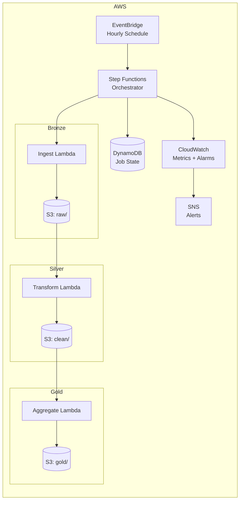

# Turnstile — Serverless Data Lake

A production-grade, serverless ETL pipeline on AWS that processes large datasets through a **Bronze → Silver → Gold** architecture with automated quality gates, error recovery, and full observability — all deployed with a single CDK command.

---

## ✨ What it does

- Ingests raw data into a structured Bronze → Silver → Gold transformation pipeline
- Enforces automated data quality gates at each layer, rejecting bad records before they propagate
- Implements safe replay logic and duplicate prevention so failed runs can be re-triggered without side effects
- Runs on an hourly schedule via EventBridge with no infrastructure to manage
- Emits CloudWatch metrics and SNS alerts for pipeline health monitoring

---

## 🏗️ Architecture



**Data layers:**
- **Bronze** — Raw data landed as-is from the source. No transformations, no deletions. Immutable.
- **Silver** — Cleaned and validated records. Quality gates run here; rejected rows are written to a dead-letter prefix for inspection.
- **Gold** — Aggregated, business-ready data. Optimized for downstream queries via Athena.

---

## 📂 Repo structure

```
.
├─ bin/             # CDK app entrypoint
├─ lambdas/
│  ├─ ingest/       # Bronze: raw data landing
│  ├─ transform/    # Silver: cleaning + quality gates
│  ├─ aggregate/    # Gold: business aggregations
│  └─ shared/       # Shared utilities (S3 helpers, DynamoDB state)
├─ lib/
│  └─ turnstile-stack.ts   # CDK stack definition
├─ test/            # CDK stack unit tests
├─ cdk.json
└─ README.md
```

---

## ✅ Prerequisites

- AWS account with CLI configured: `aws sts get-caller-identity`
- Node.js 18+, npm
- Python 3.11 (for Lambda function development)
- CDK bootstrapped once per account/region:
  ```bash
  npx cdk bootstrap
  ```
- Athena workgroup and Glue Data Catalog enabled in your target region

---

## 🚀 Deploy

```bash
npm install
npm run build
npx cdk deploy
```

The stack creates:
- S3 buckets: `raw/`, `clean/`, `gold/`, `dlq/` (dead-letter for rejected records)
- DynamoDB table for job state tracking and duplicate prevention
- Step Functions state machine orchestrating the full pipeline
- Lambda functions: `IngestFn`, `TransformFn`, `AggregateFn`
- Glue crawlers for automatic schema detection on Silver and Gold layers
- Athena workgroup for ad-hoc queries against Gold data
- EventBridge rule for hourly orchestration
- CloudWatch alarms + SNS topic for pipeline alerts

---

## ⚙️ Configuration

Key environment variables passed to Lambdas via CDK:

| Variable | Description |
|---|---|
| `RAW_BUCKET` | S3 bucket for Bronze layer |
| `CLEAN_BUCKET` | S3 bucket for Silver layer |
| `GOLD_BUCKET` | S3 bucket for Gold layer |
| `DLQ_BUCKET` | S3 bucket for rejected records |
| `STATE_TABLE` | DynamoDB table for job state |
| `SNS_ALERT_TOPIC` | SNS topic ARN for pipeline alerts |

---

## 🔁 Replay & error recovery

Turnstile tracks job state in DynamoDB using a composite key of `(source, partition_date, run_id)`. This enables:

- **Duplicate prevention** — Re-running the same job for the same partition is a no-op if it already succeeded
- **Safe replay** — Failed runs can be re-triggered via Step Functions console or CLI without risking double-writes
- **Partial recovery** — Each layer checkpoints independently; a Silver failure doesn't re-run Bronze

To manually trigger a replay for a specific partition:

```bash
aws stepfunctions start-execution \
  --state-machine-arn "$STATE_MACHINE_ARN" \
  --input '{"date":"2024-01-15","force_replay":true}'
```

---

## 📊 Monitoring & alerting

CloudWatch alarms are configured for:
- Step Functions execution failures
- Lambda error rates above threshold
- DLQ record count (rejected rows accumulating)
- Pipeline duration exceeding SLA window

All alarms publish to an SNS topic. Wire your email or Slack webhook to the topic ARN printed in the CDK outputs.

```bash
# Subscribe an email to pipeline alerts
aws sns subscribe \
  --topic-arn "$SNS_TOPIC_ARN" \
  --protocol email \
  --notification-endpoint your@email.com
```

---

## 🔍 Querying Gold data with Athena

After a successful pipeline run, Gold-layer data is queryable via Athena:

```sql
-- Example: daily aggregates
SELECT
  partition_date,
  metric_name,
  SUM(value) AS total
FROM gold_db.aggregates
WHERE partition_date >= '2024-01-01'
GROUP BY 1, 2
ORDER BY 1 DESC;
```

Run the Glue crawler first if the schema has changed:

```bash
aws glue start-crawler --name turnstile-gold-crawler
```

---

## 🔐 Security

- S3 buckets have `BlockPublicAccess` enabled and server-side encryption
- Lambda execution roles follow least-privilege (scoped to specific bucket prefixes and DynamoDB table)
- Step Functions execution logs stored in CloudWatch with configurable retention
- DynamoDB table uses on-demand capacity with point-in-time recovery enabled

---

## 💸 Cost profile

Costs are driven by Lambda invocations, Step Functions state transitions, S3 storage, and Glue crawler runs. At hourly frequency with modest dataset sizes, monthly cost is typically low single-digit dollars. Athena query costs scale with data scanned — partitioning Gold data by date significantly reduces scan costs.

---

## 🧹 Cleanup

```bash
npx cdk destroy
```

> **Note:** S3 buckets with data require manual emptying before the stack can be fully deleted.

---

## 📄 License

MIT
